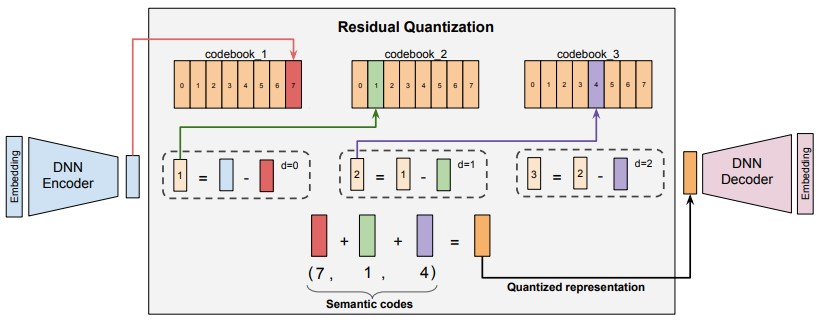

# Semantic-ID

Semantic ID Generation based on RQ-VAE Architecture for Recommendation purposes based on the presented architecture in "Recommender Systems with Generative Retrieval" by Rajput S. et al. and "Better Generalization with Semantic IDs: A Case Study in Ranking for Recommendations" by Singh A. et al..

The items in the corpus are mapped to a tuple set of semantic IDs by trraing an RQ-VAE, see Figure below.

## Installation

1. Clone the repository

2. Run the `install.ps1` script to install all dependencies into a virtual envrionment.

## Executing

## References

[Recommender Systems with Generative Retrieval](https://arxiv.org/abs/2305.05065) by Shashank Rajput, Nikhil Mehta, Anima Singh, Raghunandan H. Keshavan, Trung Vu, Lukasz Heldt, Lichan Hong, Yi Tay, Vinh Q. Tran, Jonah Samost, Maciej Kula, Ed H. Chi, Maheswaran Sathiamoorthy

[RQ-VAE Recommender - Inspirational Git Reposiory](https://github.com/EdoardoBotta/RQ-VAE-Recommender) by Edoardo Botta

[Better Generalization with Semantic IDs: A Case Study in Ranking for Recommendations](https://arxiv.org/abs/2306.08121) by Anima Singh, Trung Vu, Nikhil Mehta, Raghunandan Keshavan, Maheswaran Sathiamoorthy, Yilin Zheng, Lichan Hong, Lukasz Heldt, Li Wei, Devansh Tandon, Ed H. Chi, Xinyang Yi
